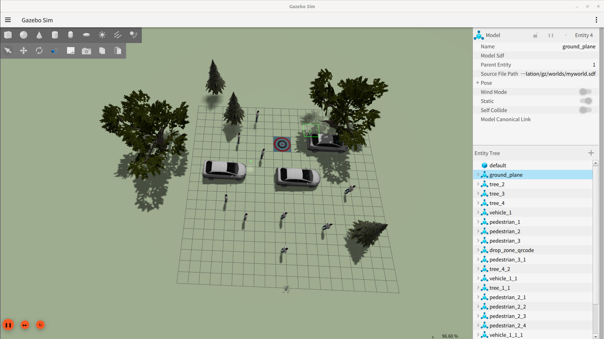
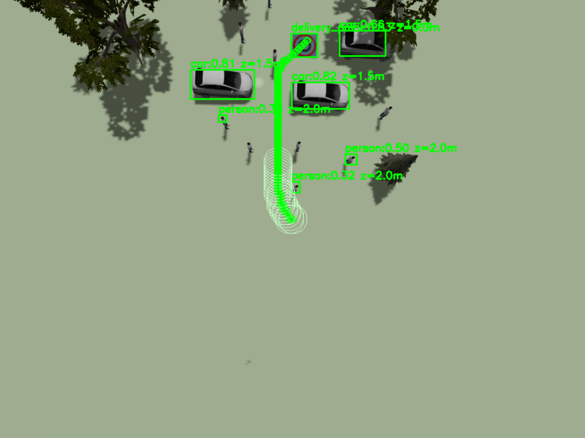
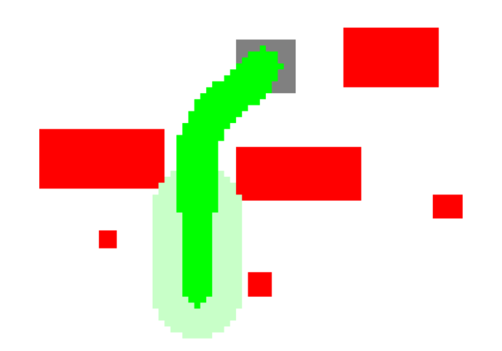

<h1 align="center">MonoObstacle-Avoidance</h1>


[](https://docs.python.org/3/whatsnew/3.10.html) [](https://docs.ros.org/en/humble/index.html) [](https://releases.ubuntu.com/22.04/)

## 项目介绍
无人机在末端物流抛投时避障程序，搭载下视广角单目相机，仅基于yolo模型推理输出。在空中避开地面障碍物，最终在抛投点搜索安全区域并顺利降落。

## 效果展示

| 图1 | 图2 | 图3 |
|:---:|:---:|:---:|
|  |  |  |

## 启动
请严格遵守以下软件版本：

- Ubuntu22.04 / WSL2(Ubuntu22.04)
- ROS2 Humble
- [PX4-Autopilot v1.16](https://docs.px4.io/main/zh/)
- Gazebo sim 8
- MavROS
- [Yolov5](https://github.com/ultralytics/yolov5)

**I. 按照下述步骤启动PX4+ROS2+gazebo仿真**
```
# step1: 添加Gazebo模型路径
export GZ_SIM_RESOURCE_PATH=$GZ_SIM_RESOURCE_PATH:/path/to/tuhu_tangsh_ws
# step2: 打开PX4仿真
cd PX4-Autopilot
PX4_GZ_NO_FOLLOW=1 PX4_GZ_MODEL_POSE="-10,0,0.5,0,0,0" make px4_sitl gz_x500_mono_cam_down PX4_GZ_WORLD=myworld
# step3: 连接MavROS
ros2 launch mavros px4.launch fcu_url:="udp://:14540@127.0.0.1:14557" 
# step4: 连接gazebo-相机模型桥接器
ros2 run ros_gz_bridge parameter_bridge /world/myworld/model/x500_mono_cam_down_0/link/camera_link/sensor/camera/image@sensor_msgs/msg/Image@ignition.msgs.Image
```

**II. 启动单目视觉避障节点**
```
# step1：图片请用imgae_pub_node.py;视频请用video_pub_node;下述采用实时视频流
python /path/tp/tuhu_tangsh_ws/src/camera_publish_node/camera_pub_node.py
# step2: 启动感知与建图节点
conda activate yolov5
python /path/to/tuhu_tangsh_ws/src/sensing_node.py
# step3: 启动导航与规划节点
python /path/to/tuhu_tangsh_ws/src/navigation_node.py
```

**III. rqt可视化**
```
ros2 run rqt_image_view rqt_image_view
```

以下是参考效果视频
[📹 PX4+ROS2+Gazebo避障展示](参考效果.mp4)

## 工作空间介绍
**I. 文件夹简介**
- /src 主代码文件夹
- /world 仿真世界文件夹，包括人、车、树、投放点
- /yolov5 yolov5官方模型文件夹
- /test_video_and_photo 测试用例，包括视频、图片
- /yolo_datebase yolo模型训练数据
- /past 包含历史程序

**II. 节点介绍**
项目共有三个节点：感知节点、导航节点、可视化节点，如下：
- sensing_node.py
- navigation_node.py
- visualisation_node.py

感知节点用于目标识别模型推理，根据Bbox及Class构建轻量化栅格地图;导航节点用于空中躲避地面障碍物并安全降落，状态机如下；可视化节点用于记录飞行过程中模型推理情况和航路规划。
```
    INIT = 0         # 解锁/模式切换阶段
    TAKEOFF = 1      # 起飞阶段
    NAVIGATE = 2     # 导航阶段
    REACHED = 3      # 到达目标点阶段
    LANDING = 4      # 降落阶段
    LANDED = 5       # 降落完成阶段
```